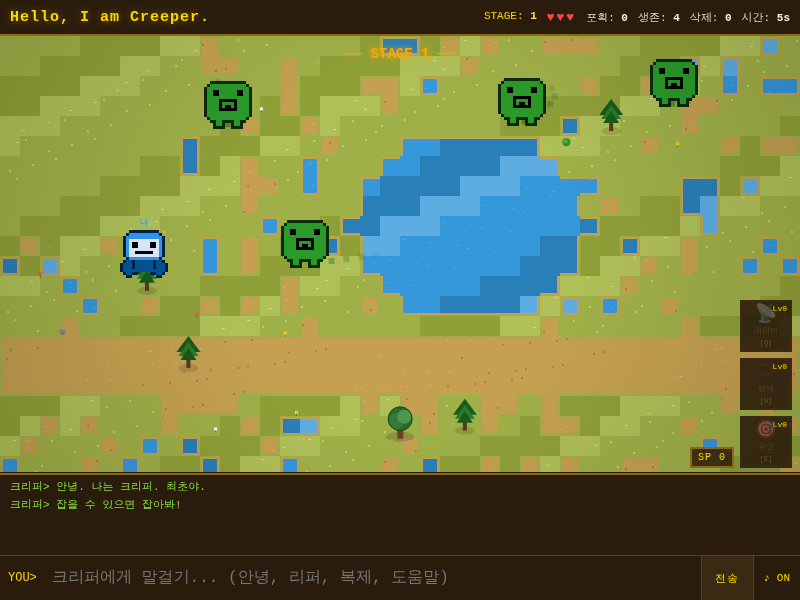

# Creeper - ARPANET 1971

1971년 ARPANET에 침입한 최초의 자기복제 바이러스 **Creeper**를 추적하는 브라우저 게임.

## Game Screenshot



## Features

- WFC(Wave Function Collapse) 알고리즘 기반 프로시저럴 타일맵 생성
- 스테이지별 테마 (초원 / 사막 / 설원 / 마법숲)
- 호수, 흙길, 집, 나무 등 환경 요소 자동 배치
- 스킬 시스템 (레이더 / 방패 / 유인) 3라인 x 3레벨
- 멀티플레이어 (실시간 위치 동기화, 스킬 선택 동기화)
- 리퍼 AI (순찰 / 매복 / 추적 / 포식자 4단계 진화)
- 10 스테이지 + 엔딩

## Getting Started

```bash
npm install
npm run dev
```

[http://localhost:3000](http://localhost:3000)에서 플레이.

## Deploy

```bash
npm run build
```

Vercel에 자동 배포 설정 가능.
